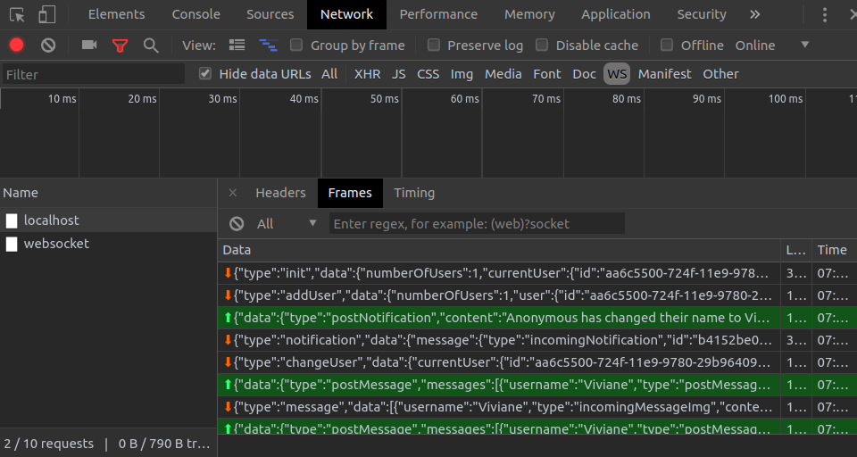

# WebSockets

WebSocket provides duplex communication between the client and server, which means that it is a two-way communication channel that allows both the server to send messages to the client, and the client to send messages to the server.

WebSockets can be very useful in applications where the server needs to notify a client (or multiple clients) of any updates which occur.

To check in the chrome if data is beign sent to the server and if the server is sending to the client:

# UUID

UUIDs are unique identifiers that look like strings. Ex: 0b2635a4-82b0-4e49-803e-2b901be71cf6.
The format is a well-defined sequence of 32 hex digits grouped into chunks of 8-4-4-4-12. This gives us 2^128 or about 10^38 numbers.
